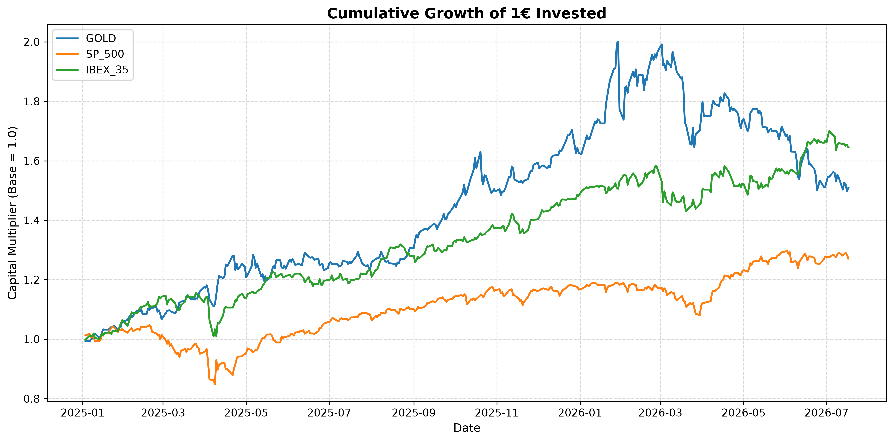
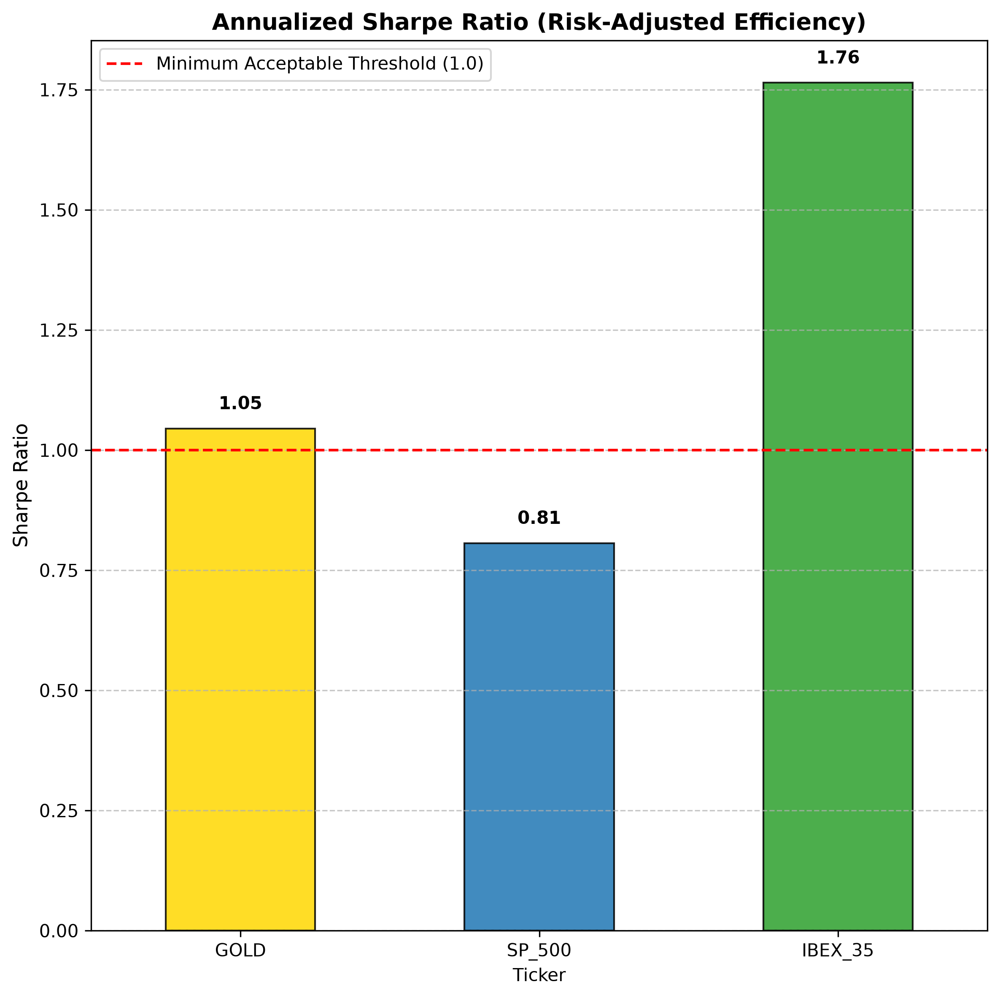

# Quantitative_Financial_Analysis_Proyect
> **Financial Data Science Case Study:** Volatility assessment, cross-classification, and risk-adjusted return (Sharpe Ratio)

# 📊 Quantitative Asset Analysis: Gold, S&P 500 & IBEX 35

> **Financial Data Science Case Study:** Volatility assessment, cross-asset correlation, and risk-adjusted efficiency (Sharpe Ratio).

---

## 📌 Executive Summary

This study analyzes the historical daily performance, volatility, and risk-adjusted efficiency of three major market benchmarks (**Gold**, **S&P 500**, and **IBEX 35**) to evaluate capital efficiency beyond gross returns.

### 💡 Key Findings

* **🏆 Efficiency Leader:** **IBEX 35** achieved the highest Sharpe Ratio (**1.76**), offering the highest excess return per unit of total risk.
* **🎢 Gold's Volatility:** Gold registered the highest daily volatility ($\sigma = 1.59\%$), acting as a high-volatility asset over the analyzed timeframe.
* **🛡️ Effective Diversification:** A low cross-asset correlation ($r = 0.12$) between Gold and the S&P 500 confirms Gold's role as an effective short-term portfolio diversifier.

---

## 📊 Quantitative Metrics Summary

| Asset | Daily Volatility ($\sigma$) | Annualized Sharpe Ratio ($R_f = 3\%$) | Rating |
| :--- | :---: | :---: | :---: |
| **IBEX 35** | 1.07% | **1.76** | 🟢 Excellent |
| **Gold** | 1.59% | **1.05** | 🟡 Acceptable |
| **S&P 500** | 1.06% | **0.81** | 🔴 Insufficient |

---

## 📐 Quantitative Methodology

### Annualized Sharpe Ratio

Formulated by William F. Sharpe (1966), the Sharpe Ratio measures excess return per unit of total risk:

$$ \text{Annualized Sharpe Ratio} = \frac{\bar{R}_p - R_{f,\text{daily}}}{\sigma_p} \times \sqrt{252} $$

Where:
* $\bar{R}_p$: Mean daily return of the asset.
* $R_{f,\text{daily}}$: Fixed daily risk-free rate derived from a 3% annual benchmark ($0.03 / 252$).
* $\sigma_p$: Standard deviation of daily returns.
* $\sqrt{252}$: Annualization factor based on 252 trading days.

---

## 🛠️ Tech Stack & Dependencies

* **Language:** Python
* **Data Extraction:** `yfinance`
* **Data Processing:** `pandas`, `numpy`
* **Visualization:** `matplotlib`, `seaborn`

---

## 📈 Visual Analysis & Market Data

### 1. Daily Percentage Returns Statistics
Summary statistics for daily percentage returns ($\%$) across the analyzed timeframe:

| Metric | Gold (`GC=F`) | S&P 500 (`^GSPC`) | IBEX 35 (`^IBEX`) |
| :--- | :---: | :---: | :---: |
| **Data Count** | 397 | 397 | 397 |
| **Mean Daily Return** | 0.116% | 0.066% | **0.131%** |
| **Daily Volatility ($\sigma$)** | **1.588%** | 1.065% | 1.075% |
| **Best Day (Max)** | 6.083% | **9.515%** | 4.323% |
| **Worst Day (Min)** | -11.366% | -5.975% | -5.831% |

---

### 2. Cumulative Growth of 1€ Invested
Evolution of historical capital performance over time:

---

### 3. Cross-Asset Correlation Matrix
Evaluating diversification benefits using daily return correlation ($r$):

| Asset | Gold | S&P 500 | IBEX 35 |
| :--- | :---: | :---: | :---: |
| **Gold** | `1.00` | **`0.12`** | `0.21` |
| **S&P 500** | `0.12` | `1.00` | `0.29` |
| **IBEX 35** | `0.21` | `0.29` | `1.00` |

> 💡 **Takeaway:** The low correlation of **0.12** between Gold and the S&P 500 confirms that Gold acts as an effective short-term risk diversifier.

---

### 4. Risk-Adjusted Performance (Annualized Sharpe Ratio)
Comparing excess return relative to total risk ($R_f = 3\%$):

